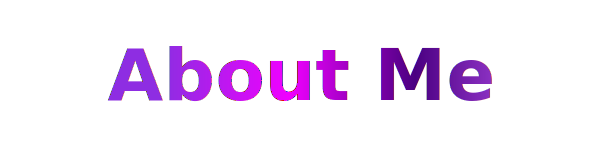
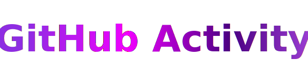

<div align="center">

<!-- ================= Banner ================= -->


<!-- ================= Typing Animation ================= -->


<!-- ================= Intro Line ================= -->
<h3 align="center">
  👋 Hi, I'm Tushar — Passionate about building scalable, smart, and impactful digital solutions 🚀
</h3>

<p align="center">
  💜 Crafting Scalable & Reliable Software for Real-World Impact
</p>

<!-- ================= Social Buttons ================= -->
<p align="center">

<a href="https://tusharsainidev.vercel.app/" target="_blank">
  
</a>

<a href="https://www.linkedin.com/in/tushar-saini-105865373/" target="_blank">
  
</a>

<a href="mailto:tusharsaini.in@gmail.com">
  
</a>

</p>

<!-- ================= Stats ================= -->
<p align="center">

<a href="https://github.com/TusharSaini999">
  
</a>

<a href="https://github.com/TusharSaini999">
  
</a>


</p>
</div>


<!-- ================= About Me ================= -->
<h3 align="center">

</h3>

```json
{
  "status": 200,
  "message": "Profile fetched successfully",
  "data": {
    "id": "TusharSaini999",
    "name": "Tushar Saini",
    "role": "Software Engineer",
    "location": "India 🇮🇳",

    "focus": ["Full Stack Development","DSA","AI & Machine Learning","Scalable Architecture"],

    "mindset": "Always Learning • Always Improving • Always Building ",
    "status": "Open to Opportunities"
  }
}
```
<div align="center">
<!-- Profile Summary Card --> 
</div>


<!-- Tech stack-->
<h3 align="center">

</h3>
<table align="center" width="900">
<tr>
  <td align="center" width="300">
    
    <br>
    
  </td>

  <td align="center" width="300">
    
    <br>
    
  </td>

  <td align="center" width="300">
    
    <br>
    
  </td>
</tr>

<tr>
  <td align="center" width="300">
    
    <br>
    
  </td>

  <td align="center" width="300">
    
    <br>
    
  </td>

  <td align="center" width="300">
    
    <br>
    
  </td>
</tr>
</table>
<table width="100%" border="0%" align="center">
<tr>

<td align="center" width="50%">


</td>

<td align="center" width="50%">


</td>

</tr>
</table>


<!-- Github -->
<h3 align="center">

</h3>
<p align="center">
  
</p>


<!--Thought-->
<h3 align="center">
  
</h3>
<p align="center">
  
</p>

<!-- Footer -->


<p align="center">💜 Thanks for visiting — Building the Future with Code 🚀 | ⭐ Star if you like | — <b>Tushar Saini</b></p>


